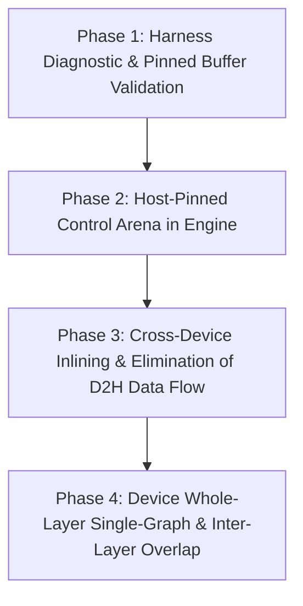

# Async Pipeline Transformation Roadmap

[English](ASYNC_PIPELINE_ROADMAP.md) | [简体中文](ASYNC_PIPELINE_ROADMAP.zh-CN.md)

## 1. Overview & Motivation

In previous profiling and diagnostics (e.g. `vk_async_probe`), an apparent bottleneck was identified where asynchronous transfers seemingly yielded no performance advantage over synchronous ones (`0.94ms` vs `0.92ms`). In-depth code analysis of `ggml-vulkan.cpp` revealed the root cause:
- `ggml_backend_tensor_get_async` relies on `ggml_vk_host_get` to determine if the destination pointer is Vulkan-pinned host memory.
- When regular heap memory (`std::vector` or raw malloc) is passed, `ggml_vk_host_get` fails (`ret == false`).
- Under this fallback path, the backend forces an internal call to `ggml_vk_synchronize(ctx)` for every single tensor retrieval, entirely serializing what was intended to be an asynchronous batch.

This roadmap outlines the systematic architectural transformation to eliminate host-device transfer overhead, unlock genuine asynchronous queue batching, inline cross-device movements into compute graphs, and establish inter-layer overlap pipelines.

---

## 2. Core Architectural Principles

1. **GPU Equivalence Principle (AGENTS.md #11)**:
   - Intermediate activations and tensors must reside entirely on the device arena.
   - The CPU acts strictly as an asynchronous dispatcher and scheduler; it must never round-trip intermediate activations (`cur`, `moe_out`) back and forth across the PCIe bus simply to orchestrate execution.
2. **Control Flow vs. Data Flow Segregation**:
   - **Control Flow (`ids`)**: Lightweight, strictly bounded. CPU requires token-to-expert mapping for scheduler pin / prefetch operations. Must use **Host-Pinned Arenas** so that D2H copies do not trigger synchronous flushes.
   - **Data Flow (`cur`, `weights`, `moe_out`, carry)**: High bandwidth. Must be completely inlined into compute graphs or handled via device-local aliasing (Views), completely bypassing the CPU host.
3. **Strict Compilation Entry Point**:
   - All builds, unit tests, and diagnostics must be driven through `build.bat`.

---

## 3. Transformation Phases

### Phase 1: Diagnostic Harness Verification
- **Target**: `diagnostics/vk_async_probe.cpp`
- **Action**: Allocate readback destination buffers from `ggml_backend_dev_host_buffer_type(dev)` (`HOST_VISIBLE | HOST_COHERENT`).
- **Goal**: Benchmark genuine `3x async + 1 sync` versus `3x sync` on actual hardware (e.g. RX590) to measure the true queue consolidation speedup.

### Phase 2: Host-Pinned Control Arena
- **Target**: `src/backend/` and `src/backend/minigraph_exec.cpp`
- **Action**:
  - Introduce a persistent, dedicated Host-Pinned Control Arena for each context / device.
  - Route the extraction of `ids` (and routing metadata required by `sched.pin_layer`) through this pinned arena.
  - Guarantee that `ggml_backend_tensor_get_async` executes non-blocking command buffer appends without hitting the internal fallback `ggml_vk_synchronize`.

### Phase 3: Graph Inlining & Elimination of Data-Flow D2H
- **Target**: `minigraph_exec.cpp` and `route_b_chain.cpp`
- **Action**:
  - **Same-Device Zero-Copy**: When C1 (Dense Head) and MoE share a device, bind `cur` as a direct `VIEW` of the dense head output in the device arena (eliminating `ROUTE_B_XFER_CLOSURE`).
  - **Inter-Layer Residue Residency**: Keep `moe_out` resident on the device arena across layers, accumulating residuals directly in VRAM. Only perform D2H readback at the final layer or explicitly exported tensors.
  - **Gating Tail Decoupling (Option G)**: Evaluate keeping Gating Tail (softmax / top-k) entirely on host or overlapping it with dense execution.

### Phase 4: Whole-Layer Single Graph & Inter-Layer Overlap
- **Target**: Minigraph execution engine & scheduler
- **Action**:
  - Merge `dense_tail` directly into the device execution graph, reducing per-layer command submissions from 3 to 1~2.
  - Implement double-buffered cross-layer execution: CPU prepares and asynchronously submits Layer $L+1$ while GPU compute for Layer $L$ is in flight, synchronized via hardware events/semaphores.

---

## 4. Verification & Regression Standard

Per project specifications:
- **Build**: Strictly via `build.bat` (`llamalibs`, `test`, `harness`).
- **Numerical Regression**: Fixed 129-token input sequence; threshold is $\ge 90\%$ of tokens having $\cos \ge 0.99$.
- **Step-by-Step Commit**: Verify regressions after each stage, commit locally, and synchronize immediately via `git push origin main`.
