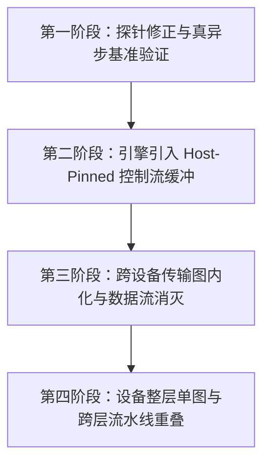

# 异步改造与高性能流水线路线图

[English](ASYNC_PIPELINE_ROADMAP.md) | [简体中文](ASYNC_PIPELINE_ROADMAP.zh-CN.md)

## 1. 概述与背景

在先前的性能诊断中（如 `vk_async_probe` 探针），曾出现异步传输与同步传输耗时完全无差异的表象（`0.94ms` vs `0.92ms`），并得出了“合成一次 fire 省不出东西”的结论。经深入研读 `ggml-vulkan.cpp` 底层源码，发现其根因在于：
- `ggml_backend_tensor_get_async` 依赖 `ggml_vk_host_get` 检查目标指针是否属于 Vulkan 注册的 Pinned Host 内存。
- 当传入普通的 C++ 堆内存（`std::vector` 或 malloc 分配内存）时，`ggml_vk_host_get` 无法匹配到缓冲句柄（`ret == false`）。
- 在此降级分支下，Vulkan 后端在函数内部对每一次调用都强制执行了 `ggml_vk_synchronize(ctx)`，导致所谓的 3 次异步读回实际上被串行化成了 3 次独立同步等待！

本路线图旨在系统性清除 Host-Device 间冗余搬运，打通真正的非阻塞队列批处理，将跨设备搬运内嵌进计算图，并建立跨层流水线重叠机制。

---

## 2. 核心架构准绳

1. **GPU 等价性准绳（AGENTS.md 第 11 条）**：
   - 中间激活值与张量必须完全驻留在设备端 Arena 中。
   - CPU 严格充当异步分发器与调度器，严禁为了“假装能跑”在每层之间把中间量（`cur`、`moe_out`）频繁搬回 CPU。
2. **控制流与数据流严格分离**：
   - **控制流（`ids` 等）**：极轻量、大小严格有界。CPU 调度器（`sched.pin_layer` / IOCP 预取）必须感知的专家索引，必须通过 **Host-Pinned Arena** 读回，确保 `get_async` 绝不触发内部同步。
   - **数据流（`cur`、`weights`、`moe_out`、carry）**：高带宽张量。必须全部通过计算图内联或显存局部别名（View / Zero-Copy）消化，严禁每层流回 Host。
3. **编译唯一入口**：
   - 所有主程序、库、测试及探针的构建，必须统一通过 `build.bat`。

---

## 3. 阶段演进路线

### 第一阶段：探针修正与真异步基准验证
- **目标**：`diagnostics/vk_async_probe.cpp`
- **动作**：将接收端 buffer 改用 `ggml_backend_dev_host_buffer_type(dev)`（`HOST_VISIBLE | HOST_COHERENT`）分配。
- **目的**：在实际显卡（RX590 等）上实测真正的 `3x async + 1 sync` 对比 `3x sync`，用无可辩驳的数据验证真异步批处理的提速上限。

### 第二阶段：引擎级 Host-Pinned 控制流缓冲
- **目标**：`src/backend/` 及 `src/backend/minigraph_exec.cpp`
- **动作**：
  - 为每个上下文 / 设备引入持久化、专用的 Host-Pinned Control Arena（数十 KB 级）。
  - 将 CPU 调度器必须读取的 `ids` 路由索引等元数据迁移到该 Pinned 区域。
  - 保证 `ggml_backend_tensor_get_async` 真正走入非阻塞的 `vkCmdCopyBuffer` 追加逻辑，杜绝内部强行同步。

### 第三阶段：跨设备流转图内化与数据流 D2H 消灭
- **目标**：`minigraph_exec.cpp` 与 `route_b_chain.cpp`
- **动作**：
  - **同设备零拷贝**：当 C1（Dense Head）与 MoE 位于同一物理设备时，`cur` 直接作为 dense head 输出的显存 `VIEW`，彻底消除 `ROUTE_B_XFER_CLOSURE`。
  - **跨层残差显存常驻**：中间层 `moe_out` 与残差计算留在设备显存直接累加，取消逐层 D2H 回传，仅在终层统一回传。
  - **Gating 尾段解耦（G 方案）**：评估将 Gating 尾段（Softmax / Top-k）留在 Host 计算，彻底消除 GPU $\to$ CPU 的读回需求。

### 第四阶段：整层单图融合与跨层流水线重叠
- **目标**：Mini-graph 执行引擎与调度流水线
- **动作**：
  - 将 `dense_tail` 直接并入 MoE 执行图，将整层的 Command Buffer 提交次数由 3 次降为 1~2 次。
  - 实现跨层双缓冲流水线：GPU 在计算第 $L$ 层 MoE 时，CPU 异步构建并提前提交第 $L+1$ 层的 Head 图，通过设备事件/信号量实现硬件握手。

---

## 4. 验证与回归规约

- **构建入口**：永远使用 `build.bat`。
- **数值门禁**：固定 129-token 输入，整个序列中 $\cos \ge 0.99$ 的 token 比例达到 90% 即为通过。
- **分步闭环**：每完成一个独立步骤，先做回归验证，确认通过后本地 commit 并同步 `git push origin main`。
